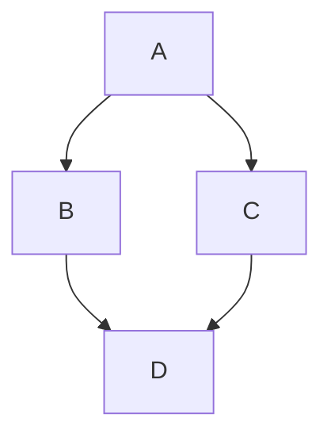

# Page 1

This is the first page. It contains a simple paragraph of text.

Here is a link back to the [home page](index.md).

## Mermaid Diagram

## Jump Section

* [index.md](index.md)
* [page2.md](page2.md)
* [sub-pages/index.md](sub-pages/index.md)
* [sub-pages/sub-page1.md](sub-pages/sub-page1.md)
* [sub-pages/sub-page2.md](sub-pages/sub-page2.md)
