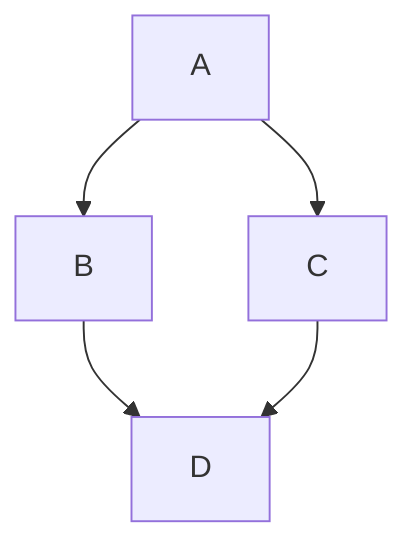

# Sub-page 1

This is the first sub-page.

Here is a link back to the [sub-pages index](../sub-pages/index.md).

## Mermaid Diagram

## Jump Section

* [index.md](../index.md)
* [page1.md](../page1.md)
* [page2.md](../page2.md)
* [sub-pages/index.md](index.md)
* [sub-pages/sub-page2.md](sub-page2.md)
* [sub-pages-no-index/extra-page1.md](../sub-pages-no-index/extra-page1.md)
* [sub-pages-no-index/extra-page2.md](../sub-pages-no-index/extra-page2.md)
